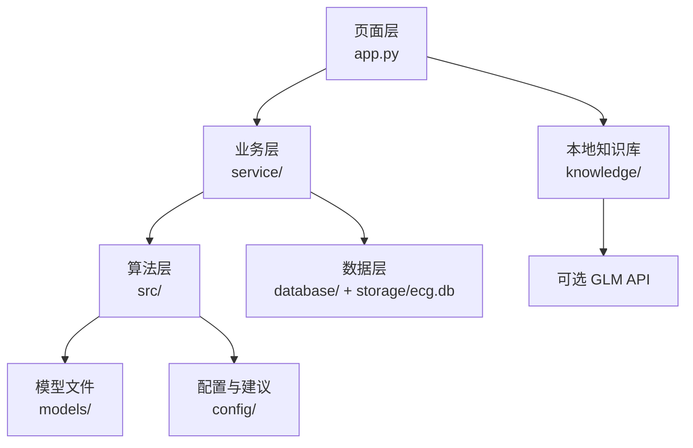

# ECG 心电风险可解释辅助筛查系统

## 1. 作品名称

ECG 心电风险可解释辅助筛查系统 v2.1.0。

## 2. 作品简介

本项目是一个基于 Streamlit 的单导联 ECG 辅助筛查工具。用户可以上传 CSV、TXT 或 DAT 心电数据，填写患者基本信息和症状，系统依次完成数据读取、信号预处理、R 峰检测、12 项 ECG/HRV 特征提取、1D-CNN 异常心拍定位和 XGBoost 风险分级。XGBoost 输出低危、中危或高危及概率，SHAP 用于解释特征贡献。系统还提供病例教学、病情统计、历史记录、SQLite 持久化、本地知识库检索、结构化报告和可选 GLM 报告润色。两条模型通路独立输出，不自动融合。

## 3. 真实功能清单

- 支持 CSV、TXT、DAT 文件，底层加载器也支持 NPY。
- MIT-BIH DAT 数据需要同目录的头文件等配套文件。
- 自动清洗信号，执行工频抑制、0.5 至 40 Hz 带通滤波、基线校正和中值滤波。
- 使用简化 Pan-Tompkins 流程检测 R 峰。
- 提取 HR、PR、QRS、QT、QTc、ST_shift、P_amp、T_amp、RR_mean、RR_std、SDNN、RMSSD 共 12 项特征。
- CNN 按心拍窗口定位可能异常的心拍。
- XGBoost 输出三级风险结果；模型不可用时由规则推理兜底。
- SHAP 提供单样本、全局、交互和决策相关解释数据，部分图表依赖训练数据文件。
- 生成离线结构化报告，依据配置规则给出特征判读和建议。
- 保存患者信息、症状、特征、风险和报告到 SQLite 历史记录。
- 提供心电分析、历史记录、病例教学、病情统计、系统设置、关于项目六个页面。
- 使用 `knowledge/ecg_diseases.json` 做本地疾病知识检索。
- GLM API 为可选能力，支持报告润色、结构化辅助解读和知识库问答；模型调用失败时保留离线建议，并按 `glm-4-flash-250414`、`glm-4-flash`、`glm-4.7-flash` 顺序 fallback。

## 4. 四层架构



### 页面层：`app.py`

负责 Streamlit 页面路由、输入控件、结果展示、图表、报告导出和页面状态。当前路由有六个页面：心电分析、历史记录、病例教学、病情统计、系统设置、关于项目。

### 业务层：`service/`

- `analysis_service.py`：编排读取、预处理、特征提取、CNN、XGBoost、SHAP 和报告生成。
- `history_service.py`：提供历史记录读取、保存、删除接口。
- `patient_service.py`：处理患者资料校验、脱敏和保存。
- `config_service.py`：初始化 session state，并把配置路径归一化为项目路径。

### 算法层：`src/`

包含数据加载、预处理、R 峰与特征提取、心拍切分、CNN 推理、XGBoost 推理、SHAP、规则报告、PDF 报告、GLM 客户端和 UI 组件。

### 数据层：`database/` 与 SQLite

`database/models.py` 定义 `records` 表，`database/db.py` 负责连接、序列化、反序列化、插入、批量写入、查询和删除。默认数据库为 `storage/ecg.db`。`特征` 和 `patient_info` 字段以 JSON 字符串保存。

## 5. 模型与评估事实

评估结果来自 `results/model_evaluation.json`，不是本次重新训练产生的指标。

| 模型 | 数据规模 | 划分 | 准确率 | 其他结果 |
|---|---:|---|---:|---|
| XGBoost | 47，留出 10 | 分层 80/20，random_state=42 | 0.90 | Macro F1=0.8901；高危敏感性未能验证 |
| 1D-CNN | 29,759，留出 5,952 | 分层 80/20，random_state=42 | 0.9800 | 参数量 43,521；异常心拍检测率 0.8611 |

XGBoost 使用 12 项特征和 300 棵 boosted trees。CNN 标签只有 normal/abnormal 二分类。

## 6. 数据库字段

当前 `records` 表有 13 个字段：

```text
record_id, 时间, 文件名, 风险等级, 风险评分, 总心拍数,
异常心拍数, 备注, 报告, 特征, patient_name, patient_info, symptoms
```

## 7. 团队与联系方式

当前仓库未提供正式团队名单、人员分工、邮箱或项目地址。以上架构按代码模块划分，不冒充正式署名。联系方式待补充。

## 8. 真实性边界

- 数据来源：MIT-BIH Arrhythmia Database 相关数据和仓库内训练文件。
- 数据划分：分层 80/20 留出。
- 当前评估未使用项目目录之外的其他外部数据集。
- 未进行外部临床数据集验证。
- XGBoost 高危敏感性未能验证，因为现有留出集没有高危样本。
- CNN 心律失常细分类未能验证，因为标签只有 normal/abnormal。
- 当前仓库未提供原始开发截图，可后续补充。

## 9. 医学免责声明

本系统用于科研、教学和初步辅助筛查，不是医疗诊断设备，输出不能替代执业医师的问诊、查体、心电图判读或其他临床检查。不得依据系统结果自行停药、换药或延误就医。出现胸痛、呼吸困难、晕厥、持续心悸等急性症状时，应立即联系急救机构或前往医院。所有结果必须由专业医护人员结合完整临床资料复核。