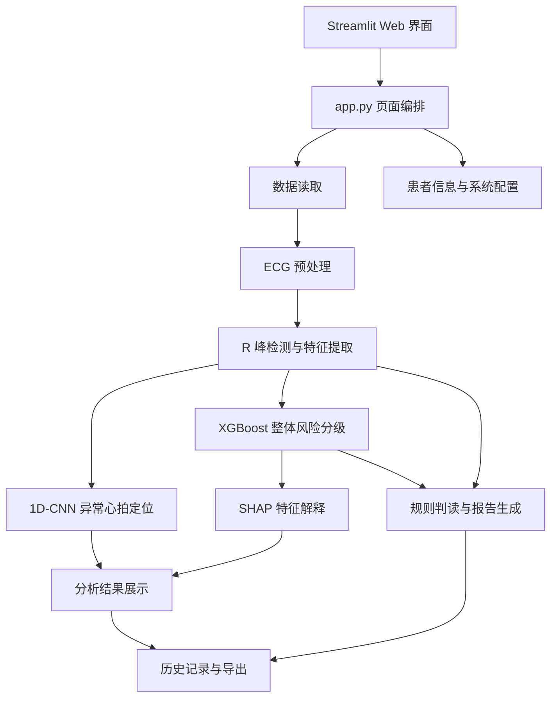
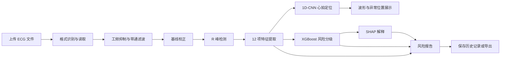

# 作品信息文档

## 一、作品名称

**ECG 心电风险可解释辅助筛查系统 v2.1.0**

## 二、作品简介

ECG 心电风险可解释辅助筛查系统是一套基于 Streamlit 的单导联心电分析工具，面向科研、教学和初步筛查场景。系统支持 CSV、TXT、DAT、NPY 等数据读取，并对信号进行工频抑制、带通滤波、中值滤波和基线校正。处理后的信号经过 R 峰检测和 12 项 ECG/HRV 特征提取后，分别进入两条推理通路：1D-CNN 用于逐心拍异常定位，XGBoost 用于整体风险分级，SHAP 用于解释 XGBoost 特征贡献。系统还提供波形展示、风险概率、特征判读、报告生成、历史记录、病例教学、病情统计和结果导出功能。结果仅供辅助分析，不替代医生诊断。

## 三、创作说明

### 3.1 功能清单

- 支持 CSV、TXT、DAT 和 NPY 格式的 ECG 文件读取；MIT-BIH 记录依赖对应的 `.hea` 文件。
- 自动识别采样率，并对输入信号做基本有效性检查。
- 自动检测 50 Hz 或 60 Hz 工频干扰，并按需进行陷波处理。
- 使用 0.5 至 40 Hz 带通滤波、中值滤波和基线校正改善信号质量。
- 使用简化 Pan-Tompkins 流程检测 R 峰。
- 提取 HR、PR、QRS、QT、QTc、ST_shift、P_amp、T_amp、RR_mean、RR_std、SDNN、RMSSD 共 12 项特征。
- 使用 1D-CNN 对固定窗口心拍进行异常定位。
- 使用 XGBoost 输出低危、中危、高危风险等级及概率。
- 使用 SHAP 展示 XGBoost 特征贡献，辅助理解模型输出。
- 根据特征阈值生成风险摘要、异常特征和辅助建议。
- 支持本地保存患者信息、症状、分析报告和历史记录。
- 支持历史记录查看、删除以及 CSV/TXT 导出。
- 提供病例教学、病情统计和系统设置页面。
- 支持模型路径、风险阈值、主题和显示选项配置。
- 可选调用 GLM 兼容接口进行报告润色、辅助诊断和知识库问答；默认关闭时不调用外部接口。

当前实现中，CNN 和 XGBoost 是两条独立通路：CNN 负责异常心拍定位，XGBoost 负责整体风险分级，系统不会自动把 CNN 结果融合成 XGBoost 输入。

### 3.2 技术架构

### 3.3 核心算法与逻辑

1. **数据读取**：`src/data_loader.py` 根据扩展名分派 CSV、TXT、DAT 或 NPY 读取逻辑；MIT-BIH 数据使用 WFDB 读取记录和采样信息。
2. **信号预处理**：`src/preprocess.py` 先清理非有限值，再按检测到的工频频率执行陷波处理，随后进行带通滤波、基线校正和必要的中值滤波。
3. **R 峰检测**：`src/feature_extract.py` 中的 `pan_tompkins` 按滤波、微分、平方、移动窗口积分和峰值筛选等步骤定位 R 峰。
4. **特征提取**：根据 R 峰位置计算心率、RR 间期统计、SDNN、RMSSD，并结合波形窗口估计 PR、QRS、QT、QTc、ST_shift、P_amp 和 T_amp。
5. **双通路推理**：`src/cnn_inference.py` 处理固定长度心拍窗口，输出异常心拍位置；`src/inference.py` 按固定的 12 项特征顺序调用 XGBoost，必要时使用规则推理兜底。
6. **可解释性**：对 XGBoost 输出计算 SHAP 贡献，展示影响风险判断的特征方向和相对贡献。
7. **报告生成**：`src/report_gen.py` 根据预设阈值判定特征状态并生成结构化报告；AI 润色属于可选路径，不能替代规则结果和医学判断。
8. **数据持久化**：历史记录写入 `storage/ecg.db` 的 `records` 表，特征和患者信息以 JSON 字符串保存，读取时恢复为字典。

### 3.4 核心分析流程

## 四、团队成员分工

当前仓库未提供正式的团队名单、工号或提交者分工表，以下内容按代码模块给出可核对的工作分区，不冒充正式人员署名：

| 分工方向 | 对应代码或资料 | 工作内容 |
|---|---|---|
| 应用与界面 | `app.py`、`src/ui_components.py` | Streamlit 页面、患者信息、分析结果、报告和设置页面 |
| 信号处理 | `src/data_loader.py`、`src/preprocess.py`、`src/feature_extract.py` | 数据读取、滤波、R 峰检测和 ECG/HRV 特征提取 |
| 模型与解释 | `src/cnn_inference.py`、`src/inference.py` | CNN 异常心拍定位、XGBoost 风险分级、SHAP 解释 |
| 服务与持久化 | `service/`、`database/`、`knowledge/` | 分析编排、历史记录、患者信息、SQLite 和知识检索 |
| 报告与验证 | `src/report_gen.py`、`src/test_*.py`、`docs/` | 规则报告、测试脚本、使用说明和项目文档 |

正式团队成员姓名、职责确认和贡献比例：**当前仓库未包含，待补充**。

## 五、联系方式

- 项目维护人：待补充
- 联系邮箱：待补充
- 项目地址：待补充
- 问题反馈渠道：待补充

## 六、医学免责声明

本系统是心电风险辅助筛查和研究教学工具，输出结果仅供参考，不能替代执业医师的问诊、体格检查、心电图判读、实验室检查或其他临床诊断。系统可能受到信号质量、采样率、数据格式、模型训练数据和阈值规则的影响，不应据此自行停药、换药或延误就医。出现胸痛、呼吸困难、晕厥、持续心悸等急性或严重症状时，应立即联系急救机构或前往医疗机构。当前项目**未进行外部临床数据集验证**，也不应被视为经过临床批准的医疗器械或诊断系统。

## 七、真实性与交付状态说明

- 当前仓库未包含原始截图，可后续补充。
- Markdown 源文档已生成，可转 PDF；当前未提供正式 PDF 文件。
- 未发现 Figma 等独立原型稿，本文件中的界面描述基于 Streamlit 实际页面结构说明。
- 当前项目未进行外部临床数据集验证。
