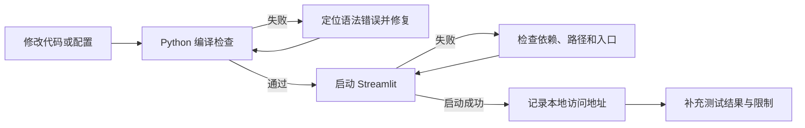

# 创作过程资料

## 一、资料说明

本文档记录 ECG 心电风险可解释辅助筛查系统 v2.1.0 的开发过程、版本迭代、问题处理和测试结果。内容来自当前 Git 历史、项目文件和已执行的验证命令。没有证据的内容统一标注为“未能验证”，不把推测写成事实。

## 二、开发过程截图清单

当前仓库未包含原始截图，可后续补充。建议补充以下截图，用于作品展示或答辩材料：

| 编号 | 建议截图 | 对应页面或过程 | 当前状态 |
|---|---|---|---|
| 1 | 应用首页和侧边栏 | Streamlit 启动后的首页 | 当前仓库未包含原始截图 |
| 2 | 患者信息填写区 | 心电分析页 | 当前仓库未包含原始截图 |
| 3 | ECG 文件上传区 | 心电分析页 | 当前仓库未包含原始截图 |
| 4 | ECG 波形与 R 峰 | 分析结果页 | 当前仓库未包含原始截图 |
| 5 | 异常心拍定位结果 | CNN 分析结果 | 当前仓库未包含原始截图 |
| 6 | 风险等级与概率 | XGBoost 分析结果 | 当前仓库未包含原始截图 |
| 7 | 12 项特征卡片 | 特征展示区 | 当前仓库未包含原始截图 |
| 8 | SHAP 解释图 | 可解释性结果区 | 当前仓库未包含原始截图 |
| 9 | 报告与导出操作 | 报告展示区 | 当前仓库未包含原始截图 |
| 10 | 历史记录和统计页面 | 历史记录/病情统计页 | 当前仓库未包含原始截图 |
| 11 | 系统设置页面 | 设置页 | 当前仓库未包含原始截图 |
| 12 | 开发过程或终端验证 | 编译、测试、启动命令 | 当前仓库未包含原始截图 |

截图应来自真实运行界面，不应使用与当前代码无关的示意图替代。

## 三、版本迭代记录

以下记录来自 `git log --oneline -20`，提交顺序为从新到旧。提交信息保持仓库原文，不补写不存在的版本号或作者信息。

```text
3fe8aa4  验证通过
2a090a6  修复主题切换+图标纯文字+风险颜色统一+趋势平滑
a835de8  修复主题切换+图标纯文字+风险颜色统一+趋势平滑
0ec6235  添加示例数据文件到仓库
4e9802f  修复云端SHAP路径：os.getcwd改为BASE_DIR
676c02d  V2.0最终版：完整功能+云端路径修复+全项目注释
eef0136  修复云端路径兼容+全项目注释规范
d19a88a  V2.0完整版：SHAP四图+双通路建议+病例教学+病情统计+API配置+三大Bug修复
1bbe578  V2.0完整版：修复三大Bug+SHAP四图+双通路建议+病例教学+病情统计+API
3f7cc15  V2.0完整版本
4e1689e  V2.0完整版本
6471c1c  V2.0完整版本
09c93cd  合并远程与本地版本
1f669da  V2.0：新增病例教学、病情统计、API接入、UI优化、健壮性提升
5bdb321  添加网站图标
e9b0071  添加网站图标
ee79b3e  修复app.py语法错误
2315fa6  修复CNN依赖版本：tensorflow-cpu==2.21.0 + keras==3.15.1
002683a  修复跨平台路径解析
1bb79fa  P2：用户手册完成
```

### 3.1 迭代阶段归纳

- **基础功能阶段**：完成项目文档、跨平台路径处理和 CNN 依赖调整。
- **V2.0 功能扩展阶段**：增加病例教学、病情统计、API 配置、SHAP 图和双通路建议。
- **稳定性修复阶段**：修复 `app.py` 语法、云端路径、主题切换和趋势展示问题。
- **演示数据阶段**：加入示例 ECG 数据，便于本地运行和教学演示。
- **当前维护阶段**：完成注释规范化、版本更新到 v2.1.0，并进行编译和启动验证。

阶段归纳是根据提交信息提炼的功能类别；仓库没有提供更细的会议纪要、任务单或人员分工记录。

## 四、开发过程中的问题及解决方案

| 问题 | 解决方案 | 依据或状态 |
|---|---|---|
| 项目路径在不同运行环境下不一致 | 使用项目根目录和 `Path`/配置路径处理资源，修复云端 SHAP 路径从当前工作目录读取的问题 | Git 提交 `002683a`、`4e9802f` |
| `app.py` 存在语法问题 | 修复入口文件语法并重新验证启动 | Git 提交 `ee79b3e` |
| CNN 依赖版本存在兼容风险 | 调整 TensorFlow CPU 和 Keras 依赖版本 | Git 提交 `2315fa6` |
| 页面主题、图标、风险颜色和趋势展示不统一 | 统一主题切换、风险颜色和趋势平滑处理 | Git 提交 `2a090a6`、`a835de8` |
| 项目缺少便于演示的输入数据 | 将示例数据文件加入仓库 | Git 提交 `0ec6235` |
| 注释风格不统一 | 在不改变运行逻辑的前提下补充模块、函数和关键流程说明 | Git 提交 `676c02d`、`eef0136` 及当前工作区修改 |
| 代码修改可能引入语法错误 | 对目标 Python 文件运行 `py_compile`，发现问题后修复再验证 | 当前工作区验证记录 |
| 缺少外部临床验证 | 不将模型输出表述为临床诊断，不宣称临床准确率 | 当前项目限制，未进行外部临床数据集验证 |

## 五、测试报告

### 5.1 测试环境与范围

- 操作系统：Windows
- Python：当前本地 Python 3.11 环境
- Web 框架：Streamlit
- 测试重点：目标文件语法、应用启动、主分析链路和模型推理脚本
- 本节只报告实际执行或代码中明确存在的测试，不推测未执行的结果。

### 5.2 已执行验证

| 编号 | 测试用例 | 执行命令/方式 | 结果 |
|---|---|---|---|
| T01 | 目标 Python 文件编译检查 | `python -m py_compile app.py src/data_loader.py src/preprocess.py src/feature_extract.py src/inference.py src/report_gen.py src/llm_client.py service/analysis_service.py service/history_service.py service/patient_service.py service/config_service.py database/db.py database/models.py knowledge/retriever.py src/ui_components.py` | 通过，退出码为 0，无语法错误输出 |
| T02 | 单文件编译检查 | `python -m py_compile src/data_loader.py` | 通过，退出码为 0 |
| T03 | Streamlit 应用启动检查 | `streamlit run app.py` | 通过，显示 Uvicorn server started on `0.0.0.0:8501`，本地地址为 `http://localhost:8501` |
| T04 | 页面入口可访问性 | 启动日志检查 | 已确认 Streamlit 输出本地访问地址；浏览器交互和截图未在本次记录中验证 |

### 5.3 项目已有测试脚本

仓库中存在以下测试或验证脚本：

- `src/test_full_pipeline.py`：读取 MIT-BIH 数据，执行预处理、R 峰检测和 12 项特征提取。
- `src/test_inference.py`：加载 XGBoost 模型并用一组 12 项特征执行风险推理。
- `src/test_pan_tompkins.py`：验证 Pan-Tompkins 相关处理。
- `src/test_real_ecg.py`：验证真实 ECG 输入。
- `src/test_shap.py`：验证 SHAP 解释路径。
- `tests/test_demo_ecg.py`：项目级示例 ECG 测试入口。

上述脚本的存在可以从仓库文件结构确认，但除 5.2 列出的编译和启动检查外，本次资料整理未重新执行每一个脚本，因此具体通过结果标注为：**未能验证**。

### 5.4 未能验证项目

- 未进行外部临床数据集验证。
- 未进行临床专家盲评或医疗器械合规验证。
- 未测量敏感度、特异度、AUC、F1 等独立临床评估指标。
- 未验证不同设备、不同导联和不同采样率下的稳定性。
- 未提供原始开发截图。
- 未生成正式 PDF 文件；Markdown 源文档已生成，可转 PDF。
- 未发现独立 Figma 原型稿；界面说明基于 Streamlit 实际页面结构。

## 六、验证流程图



## 七、当前交付状态

- 版本号：`v2.1.0`。
- 三份 Markdown 源文档已生成，可转 PDF。
- 当前仓库未包含原始截图，可后续补充。
- 当前项目未进行外部临床数据集验证。
- 文档内容基于真实代码和真实 Git 提交记录；不能据此推断临床效果。

## 八、医学免责声明

本项目仅用于心电数据的辅助分析、科研和教学演示，不能替代执业医师的诊断，也不构成医疗建议。系统输出可能受到数据质量、采样率、导联方式、模型版本、阈值规则和输入格式的影响。用户不得依据系统结果自行停药、换药或延误就医；如有胸痛、呼吸困难、晕厥、持续心悸等紧急症状，应立即联系急救机构或前往医院。当前项目**未进行外部临床数据集验证**，未经过临床专家盲评或医疗器械审批。
