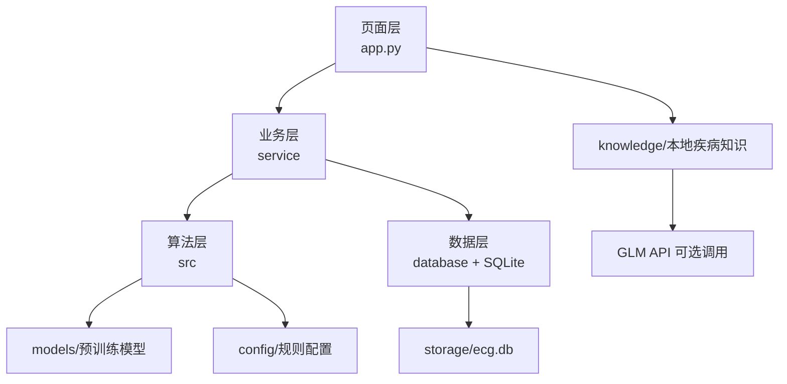
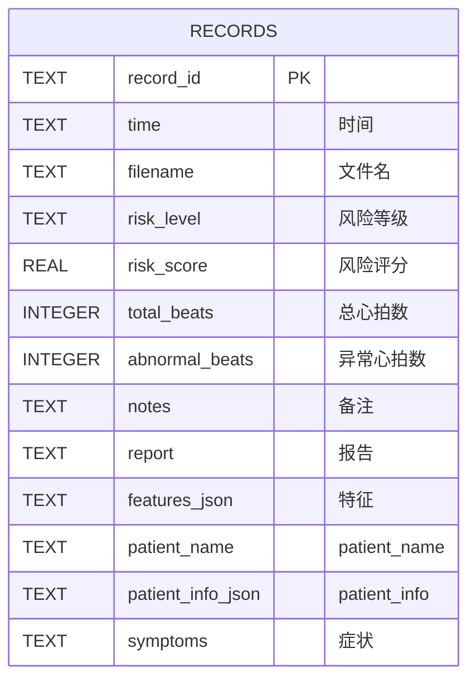
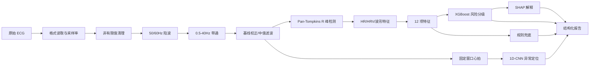

# 设计文档

## 1. 设计范围

本文档描述 ECG 心电风险可解释辅助筛查系统 v2.1.0 的当前实现。内容以 `app.py`、`src/`、`service/`、`database/`、`knowledge/`、`config/`、`requirements.txt` 和评估结果文件为准。

## 2. 需求分析

### 2.1 输入

- 单导联 ECG 文件：CSV、TXT、DAT；底层加载器支持 NPY。
- MIT-BIH DAT 记录需要对应的头文件。
- 患者信息：姓名、年龄、性别、身高、体重、既往病史、用药情况。
- 可选症状描述，随分析结果保存。
- 可选模型路径、风险阈值、主题和 GLM API 配置。

### 2.2 处理

系统需要完成信号读取、有效性检查、预处理、R 峰检测、12 项特征提取、CNN 异常心拍定位、XGBoost 风险分级、SHAP 解释和规则报告生成。

### 2.3 输出

- 清洗后的 ECG 波形、R 峰和异常心拍位置。
- 低危、中危、高危风险等级和概率。
- 12 项特征及正常/轻度异常/显著异常判读。
- SHAP 解释图和结构化报告。
- 历史记录、统计结果和 TXT/CSV 导出。

## 3. 四层技术架构



### 页面层

`app.py` 负责页面路由、Streamlit 控件、绘图、报告显示和用户操作。`src/ui_components.py` 提供公共样式和组件。

### 业务层

`service/analysis_service.py` 编排完整分析链路；`history_service.py` 封装历史记录；`patient_service.py` 处理患者资料；`config_service.py` 处理配置和 session state。

### 算法层

`data_loader.py` 读取 ECG，`preprocess.py` 负责滤波和基线处理，`feature_extract.py` 负责 R 峰和 12 项特征，`cnn_inference.py` 负责异常心拍定位，`inference.py` 负责 XGBoost、规则兜底和 SHAP，`report_gen.py` 负责报告。

### 数据层

`database/models.py` 创建 `records` 表，`database/db.py` 实现 SQLite CRUD。历史记录默认存储在 `storage/ecg.db`。

## 4. 功能设计

系统有六个页面：

| 页面 | 当前实现 |
|---|---|
| 心电分析 | 患者信息、症状、文件上传、分析、波形、风险、特征、SHAP、报告和保存 |
| 历史记录 | 患者分组、时间线、报告查看、导出和删除 |
| 病例教学 | 从 `config/cases.json` 选择病例，显示特征、分析、学习要点和处理建议 |
| 病情统计 | 统计患者数、高危数、平均年龄、性别比例、风险分布、异常特征和趋势 |
| 系统设置 | 风险阈值、模型路径、主题、SHAP 显示和 GLM API 配置 |
| 关于项目 | 系统定位、功能、技术架构、模型信息、版本和免责声明 |

### 用户操作流程


## 5. 数据库设计

当前 SQLite 数据库只有一个主要业务表 `records`，共 13 个字段。`patient_info` 和 `特征` 是 JSON 文本字段，不是独立关系表。



字段实际为：

```text
record_id, 时间, 文件名, 风险等级, 风险评分, 总心拍数,
异常心拍数, 备注, 报告, 特征, patient_name, patient_info, symptoms
```

写入时，`特征` 和 `patient_info` 通过 JSON 序列化；读取时恢复为字典。`record_id` 是主键，写入使用 `INSERT OR REPLACE`。

## 6. 核心算法设计



### 特征顺序

XGBoost 的固定输入顺序为：

```text
HR, PR, QRS, QT, QTc, ST_shift,
P_amp, T_amp, RR_mean, RR_std, SDNN, RMSSD
```

### 双通路关系

- CNN 负责心拍级异常位置和置信度。
- XGBoost 负责整体风险等级、风险分数和概率。
- 两条通路独立输出，不自动融合为新的模型输入。
- 报告生成会同时参考风险等级、异常心拍数量、特征阈值和 CNN 状态。

## 7. 模型评估

评估文件记录的是分层 80/20 留出结果：

| 模型 | 准确率 | Macro F1 | 规模 | 限制 |
|---|---:|---:|---:|---|
| XGBoost | 0.90 | 0.8901 | 47，测试 10 | 高危敏感性未能验证 |
| 1D-CNN | 0.9800 | 0.9489 | 29,759，测试 5,952 | 心律失常细分类未能验证 |

CNN 参数量为 43,521。训练和标签来自项目现有文件，当前未进行外部临床数据集验证。

## 8. 界面原型说明

未提供 Figma 或 Axure 原型稿。界面说明以 Streamlit 实际页面为准：侧边栏负责六个页面导航，心电分析页采用患者信息/上传区与结果标签页，历史记录页采用患者卡片和时间线，设置页采用表单，病例和统计页采用表格、指标卡和 Plotly 图表。

## 9. 医学免责声明

本系统是辅助筛查软件，不是医疗诊断设备。输出结果不能替代执业医师的临床判断，不能作为自行停药、换药或延误就医的依据。胸痛、呼吸困难、晕厥、持续心悸等急性症状应立即就医。当前项目未进行外部临床数据集验证，所有输出必须由专业人员结合完整病史、波形和其他检查复核。