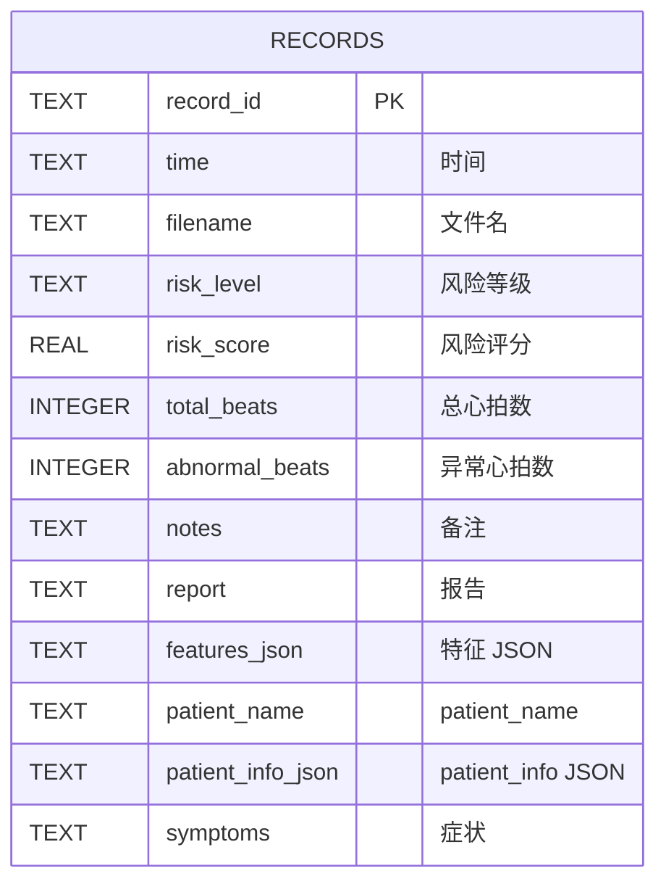
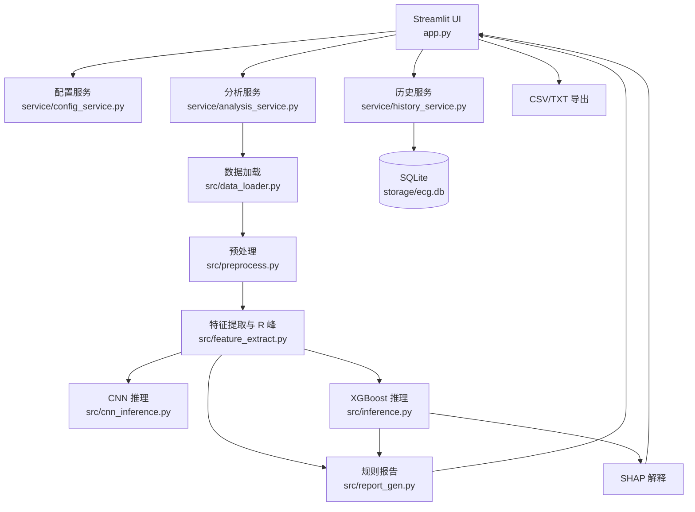
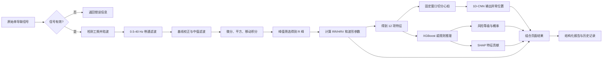

# 设计文档

## 一、文档范围

本文档描述 ECG 心电风险可解释辅助筛查系统 v2.1.0 的需求、功能、界面、数据存储、技术架构和核心处理流程。内容以当前仓库中的 `app.py`、`src/`、`service/`、`database/`、`knowledge/` 和测试脚本为依据。

## 二、需求分析

### 2.1 用户与使用场景

系统面向以下场景：

- 科研人员：对单导联 ECG 数据进行预处理、特征提取和模型实验。
- 教学人员或学生：观察 R 峰、异常心拍、风险特征和模型解释结果。
- 初步筛查使用者：上传 ECG 文件并获得风险分级和结构化辅助报告。
- 维护人员：调整模型路径、风险阈值、主题和显示配置。

### 2.2 输入需求

- 支持 CSV、TXT、DAT 和 NPY 文件；MIT-BIH DAT 记录需要配套头文件。
- 可填写姓名、年龄、性别、身高、体重、既往病史、用药情况和症状描述。
- 可加载仓库中的示例 ECG 文件进行演示。

### 2.3 输出需求

- 展示清洗后的 ECG 波形和检测到的 R 峰。
- 展示 CNN 标记的异常心拍位置。
- 展示低危、中危、高危风险等级和概率。
- 展示 12 项 ECG/HRV 特征、规则判读和 SHAP 解释。
- 生成结构化文本报告，并支持保存历史记录和导出结果。

### 2.4 非功能需求

- 本地运行：患者数据默认保存在本地，不自动上传。
- 可追溯：分析结果可写入 SQLite 历史记录。
- 可解释：风险输出应同时提供特征和 SHAP 辅助说明。
- 可维护：配置、模型路径和阈值不硬编码在每个页面中。
- 兼容性：项目按 Windows 本地运行场景编写，路径通过配置和项目根目录处理。

## 三、功能设计

### 3.1 功能模块

| 模块 | 主要功能 | 主要实现位置 |
|---|---|---|
| 心电分析 | 患者信息、文件上传、分析启动、结果展示 | `app.py`、`service/analysis_service.py` |
| 数据读取 | CSV、TXT、DAT、NPY 和 MIT-BIH 记录读取 | `src/data_loader.py` |
| 信号处理 | 陷波、带通、基线校正、中值滤波 | `src/preprocess.py` |
| 特征提取 | R 峰检测和 12 项特征计算 | `src/feature_extract.py` |
| CNN 推理 | 逐心拍异常定位 | `src/cnn_inference.py`、`src/beat_segmenter.py` |
| 风险推理 | XGBoost 分级和规则兜底 | `src/inference.py` |
| 可解释性 | SHAP 特征贡献和可视化 | `src/inference.py`、`app.py` |
| 报告 | 特征判读、风险摘要、建议 | `src/report_gen.py`、`src/llm_client.py` |
| 历史记录 | 保存、查询、删除和导出 | `service/history_service.py`、`database/` |
| 知识检索 | 本地疾病知识搜索和问答 | `knowledge/retriever.py`、`src/llm_client.py` |
| 系统设置 | 模型、阈值、主题和显示项配置 | `service/config_service.py`、`config.json` |

### 3.2 用户操作流程

### 3.3 风险输出规则

XGBoost 使用固定顺序的 12 项特征进行多分类推理，标签含义为：`0=低危`、`1=中危`、`2=高危`。当模型不可用或推理条件不满足时，代码提供规则推理路径。页面中的风险阈值由配置控制，默认中危和高危阈值分别为 0.4 和 0.7，具体显示以运行时配置为准。

CNN 与 XGBoost 不做自动融合。CNN 结果用于异常心拍定位，XGBoost 结果用于整体风险分级，二者在页面上并列展示。

## 四、界面原型说明

当前没有独立 Figma 或 Axure 原型稿，以下内容基于 Streamlit 实际页面结构说明。

### 4.1 侧边栏

- 显示项目名称“心电筛查”和辅助分析工作台说明。
- 提供“心电分析”“历史记录”“病例教学”“病情统计”“系统设置”“关于项目”入口。
- 显示当前版本 `v2.1.0` 和本地运行提示。

### 4.2 心电分析页

- 患者信息区：姓名、年龄、性别、身高、体重、既往病史、用药情况。
- 症状区：可选填写症状描述。
- 文件区：上传 ECG 文件或选择示例数据。
- 结果区：波形图、R 峰、异常心拍、风险徽章、风险概率和特征卡片。
- 解释区：SHAP 图表、报告内容、辅助建议和保存/导出操作。

### 4.3 历史记录页

- 从本地 SQLite 读取分析历史。
- 按时间查看记录摘要，可删除记录。
- 支持将历史数据导出为 CSV 或文本报告。

### 4.4 病例教学与病情统计页

- 病例教学页使用配置或本地案例数据展示教学信息。
- 病情统计页对历史记录中的风险等级和分析数据进行统计展示。
- 当前文档不将这些页面描述为临床决策系统。

### 4.5 设置与关于页

- 设置页调整模型路径、风险阈值、主题、显示项和可选 API 配置。
- 关于页展示版本、技术栈、能力边界和医学免责声明。

## 五、数据库设计

### 5.1 存储方案

当前项目使用 SQLite 文件 `storage/ecg.db` 持久化历史分析记录，默认表名为 `records`。患者信息和 ECG 特征没有拆成独立关系表，而是分别以 JSON 字符串保存在 `patient_info` 和 `特征` 字段中。以下是基于当前实现的逻辑 ER 图，不代表仓库中存在独立的 `patients` 表。

### 5.2 字段处理

- `record_id` 是记录主键，保存时使用插入或覆盖方式。
- `特征` 保存 12 项特征及相关结果的 JSON 字符串，读取时反序列化为字典。
- `patient_info` 保存患者信息字典，读取时反序列化为字典。
- `symptoms` 用于保存症状描述；数据库初始化时会检查并补齐该字段。
- `database/db.py` 负责连接、序列化、反序列化、查询、插入、批量写入和删除。

## 六、技术架构

## 七、核心算法流程

## 八、边界与风险

- 系统结果只适用于辅助分析、科研或教学，不替代执业医师诊断。
- 输入信号质量、导联方式、采样率和文件格式会影响结果。
- 当前项目使用的部分风险标签来自训练脚本的规则生成，并非独立临床专家标注。
- 当前项目**未进行外部临床数据集验证**，不能据此宣称临床准确率或临床适用性。
- 当前未提供正式的 Figma 原型稿、正式 PDF 文件或原始开发截图。

## 九、医学免责声明

本系统不是医疗诊断设备，输出结果不能替代医生的专业判断。用户不得根据系统结果自行停药、换药或延误就医。若出现胸痛、呼吸困难、晕厥、持续心悸等症状，应立即联系急救机构或到医院就诊。所有风险等级、概率、特征判读和 AI 生成内容均应由具备资质的专业人员结合完整临床资料复核。
